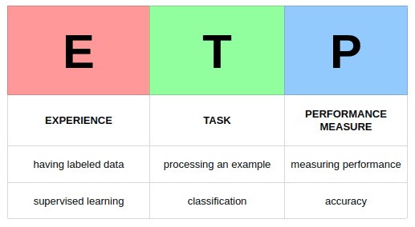

# intro_to_machine_learning
Basic exercises, knowledge related to machine learning at the approach level

## BTVN_1

- Wat is Machine Learning?
- Introduction to **ETP** (P: Performance measure, E: Experience, T: Task), **Supervised Learning**, **Unsupervised Learning**, **Semi-Supervised Learning**, **Reinforcement Learning**
- What is the most challenging step in building a machine-learning system?

## BTVN_2

- Solving the weight prediction problem using **Linear Regression**

## BTVN_3

- Comparison of three gradient descent learning algorithms: **batch gradient descent (BGD)**, **stochastic gradient descent (SGD)** and **mini-batch gradient descent (MBGD)**
- Construct an objective function with a given formula and constraints.

## BTVN_4

- **Support Vector Machine (SVM)**
- Practice with `scikit-learn` libraries (**SVC, NuSVC and LinearSVC**) on Moons Dataset

## BTVN_5

-  Use algorithms to build **Decision Trees**. Solutions to overcome the overfitting problem encountered when building decision trees
- Solve the "*PlayTennis"* problem to illustrate how **ID3** works (*in the book “Machine Learning” by author Tom m. Mitchell*)
- Classification of iris species by Andreas Mueller. Use other approaches (*e.g. Support Vector Machine, Decision Trees, Random Forests, …*) for classification and comparison

## BTVN_6_7
- Design a neural network to approximate a nonlinear function (Update late)
- Using the Fashion MNIST training dataset, author Aurelien Geron built, trained, and evaluated a multilayer neural network using **Keras** and **TensorFlow**.

## BTVN_9_10
- Learn about **Clustering** problem and its applications
- Using **k-means algorithm** to solve the "*office worker*" problem
- Apply k-means clustering algorithm to cluster the image lenna.png